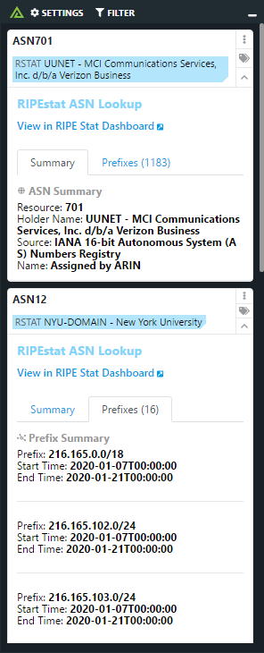

# Polarity RIPEstat Integration

The Polarity RIPEstat integration allows Polarity to returns all announced prefixes for a given ASN via the RIPEstat Data API.

For more information about this API please see https://stat.ripe.net/

|  |
|---|
|*RIPEstat lookup example* |

## Installation Instructions

Installation instructions for integrations are provided on the [PolarityIO GitHub Page](https://polarityio.github.io/).

## Polarity

Polarity is a memory-augmentation platform that improves and accelerates analyst decision making.  For more information about the Polarity platform please see:

https://polarity.io/
